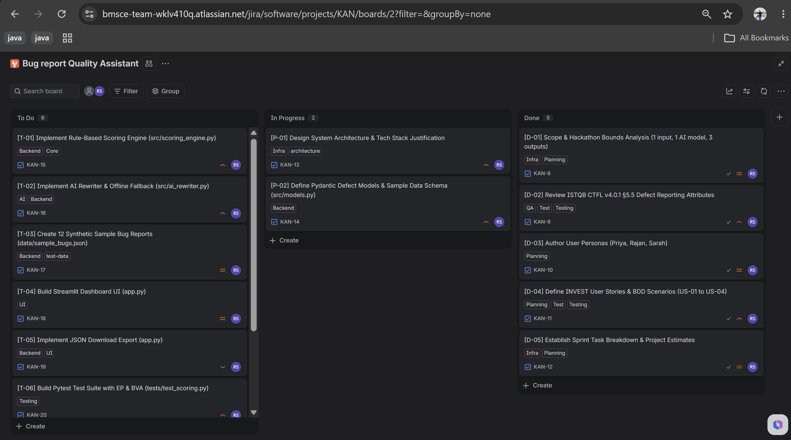
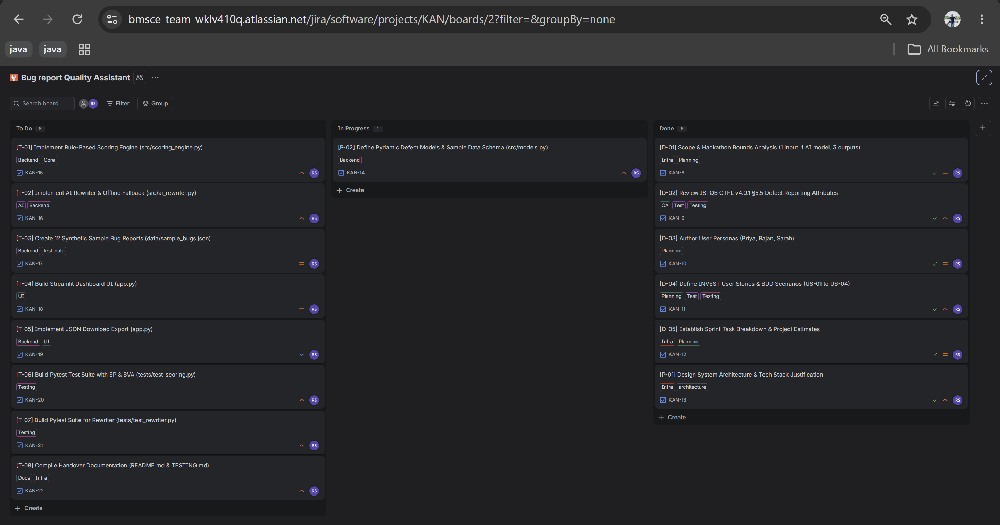

# Requirements — Bug Report Quality Assistant

> IGS Engineering Quality Fresher Hackathon 2026 
> Standard: ISTQB CTFL v4.0.1 §5.5

---

## 1. Product Summary

The **Bug Report Quality Assistant** is a lightweight web application that helps QA engineers, developers, and triage leads evaluate and improve the quality of bug reports. It ingests a bug report (structured JSON or free-form text), scores it against ISTQB CTFL v4.0.1 §5.5 defect attribute standards, surfaces actionable alerts for missing or ambiguous fields, and produces a standardised rewrite using a deterministic rule-based engine with an optional AI (GPT-4o) upgrade path.

---

## 2. User Personas

### 👩‍💻 Persona 1 — QA Engineer (Primary)

| Attribute | Detail |
|-----------|--------|
| **Name** | Priya Sharma |
| **Role** | QA Engineer (2 years experience) |
| **Goal** | Write high-quality bug reports that are immediately actionable by developers |
| **Pain Point** | Unsure which ISTQB fields are most critical; reports are often rejected or sent back |
| **Usage** | Pastes a draft report, reviews the score and alerts, copies the rewritten version |

### 🧑‍💻 Persona 2 — Developer (Secondary)

| Attribute | Detail |
|-----------|--------|
| **Name** | Rajan Mehta |
| **Role** | Senior Backend Developer |
| **Goal** | Receive bug reports with enough detail to reproduce and fix without back-and-forth |
| **Pain Point** | Too many reports lack reproduction steps or environment details |
| **Usage** | Selects a report from the dropdown to understand what information was missing |

### 👩‍💼 Persona 3 — Triage Lead (Tertiary)

| Attribute | Detail |
|-----------|--------|
| **Name** | Sarah Chen |
| **Role** | QA Lead / Triage Lead |
| **Goal** | Efficiently prioritise and route incoming defects based on completeness |
| **Pain Point** | Spending too much time on reports that need clarification before triage |
| **Usage** | Uses the JSON export to integrate quality scores into the defect tracking workflow |

---

## 3. INVEST User Stories

### US-01 — Score Bug Report Quality

> **As a** QA Engineer,  
> **I want** to submit a bug report and receive a numeric quality score (0–100),  
> **so that** I can objectively assess whether my report meets ISTQB standards before filing it.

**Acceptance Criteria (Given / When / Then):**

```gherkin
Scenario: Complete report scores high
  Given a bug report with all ISTQB §5.5 fields populated
  When I click "Analyse & Rewrite"
  Then the Quality Score should be ≥ 80 (grade: "Excellent")
  And the score breakdown should show scores across all three categories

Scenario: Empty report scores near zero
  Given a bug report with no fields populated
  When I click "Analyse & Rewrite"
  Then the Quality Score should be < 10 (grade: "Poor")

Scenario: Score breakdown matches total
  Given any bug report
  When the analysis completes
  Then total_score = structural_completeness + reproducibility + clarity_context (± 0.01)
```

**INVEST criteria:**  
- ✅ Independent, ✅ Negotiable, ✅ Valuable, ✅ Estimable (4h), ✅ Small, ✅ Testable

---

### US-02 — Surface Missing-Field Alerts

> **As a** QA Engineer,  
> **I want** to see a list of alerts for each missing or ambiguous ISTQB field,  
> **so that** I know exactly what to add or fix to improve my report quality.

**Acceptance Criteria:**

```gherkin
Scenario: Missing steps to reproduce raises error alert
  Given a bug report with no steps_to_reproduce
  When I analyse the report
  Then an alert with severity "error" for field "steps_to_reproduce" is displayed
  And the alert includes a suggestion with example action verbs

Scenario: Missing environment raises error alert
  Given a bug report with an empty environment block
  When I analyse the report
  Then an alert with severity "error" for field "environment" is displayed

Scenario: Vague language raises warning alert
  Given a bug report containing the phrase "doesn't work"
  When I analyse the report
  Then a warning alert is displayed for the affected field
  And the suggestion recommends replacing vague language with specific observations

Scenario: Complete report has no error alerts
  Given a fully populated, well-written bug report
  When I analyse the report
  Then no alerts with severity "error" are returned
```

**INVEST criteria:**  
- ✅ Independent, ✅ Negotiable, ✅ Valuable, ✅ Estimable (3h), ✅ Small, ✅ Testable

---

### US-03 — Rewrite Report to ISTQB Format

> **As a** QA Engineer,  
> **I want** to view a rewritten version of my bug report in ISTQB §5.5 format,  
> **so that** I can immediately see and copy an improved version without starting from scratch.

**Acceptance Criteria:**

```gherkin
Scenario: Missing steps generated from description
  Given a bug report with no steps_to_reproduce but a meaningful description
  When the rewriter processes the report
  Then the rewritten report contains at least 3 numbered reproduction steps
  And each step starts with an imperative verb (Click, Navigate, Enter, etc.)

Scenario: Vague language is replaced
  Given a bug report containing "doesn't work", "broken", or "please fix"
  When the rewriter processes the report
  Then the rewritten description does not contain those phrases

Scenario: Rule-based fallback works offline
  Given OPENAI_API_KEY is not set
  When the rewriter processes any bug report
  Then a valid RewrittenBug is returned with rewrite_source = "rule_based"
  And confidence_score is between 0.0 and 1.0

Scenario: Side-by-side comparison displayed
  Given any bug report that has been analysed
  When I scroll to the "Output 3" section
  Then the original and rewritten reports are shown side by side
  And the improvements list is displayed below the rewrite
```

**INVEST criteria:**  
- ✅ Independent, ✅ Negotiable, ✅ Valuable, ✅ Estimable (5h), ✅ Small, ✅ Testable

---

### US-04 — Export Triage Evaluation as JSON

> **As a** Triage Lead,  
> **I want** to download the full analysis result as a JSON file,  
> **so that** I can integrate bug quality scores into our defect tracking workflow and reporting tools.

**Acceptance Criteria:**

```gherkin
Scenario: JSON export contains all three outputs
  Given a bug report has been analysed
  When I click "Download JSON"
  Then the downloaded file contains:
    - original_report (all BugReport fields)
    - score_result (total_score, grade, breakdown, alerts)
    - rewritten_report (all RewrittenBug fields)
    - export_metadata (tool name, standard, timestamp)

Scenario: Filename includes bug ID and timestamp
  Given bug ID "BUG-001" is analysed at 2024-05-10T15:30:00
  When I click "Download JSON"
  Then the filename matches pattern: triage_BUG-001_20240510_153000.json

Scenario: JSON is valid and parseable
  Given any analysed bug report
  When the JSON export is downloaded
  Then the file parses without error in any standard JSON parser
```

**INVEST criteria:**  
- ✅ Independent, ✅ Negotiable, ✅ Valuable, ✅ Estimable (2h), ✅ Small, ✅ Testable

---

## 4. Initial Kanban Board

### ✅ Done

| ID | Task |
|----|------|
| D-01 | Set up project scaffold (`src/`, `tests/`, `data/`) |
| D-02 | Define `BugReport`, `ScoreResult`, `RewrittenBug` Pydantic v2 models |
| D-03 | Implement `scoring_engine.py` — structural completeness sub-scorer |
| D-04 | Implement `scoring_engine.py` — reproducibility sub-scorer |
| D-05 | Implement `scoring_engine.py` — clarity & context sub-scorer |
| D-06 | Implement `ai_rewriter.py` — rule-based fallback rewriter |
| D-07 | Implement `ai_rewriter.py` — OpenAI GPT-4o primary path |
| D-08 | Create `data/sample_bugs.json` with 12 synthetic reports |
| D-09 | Build Streamlit UI — hero header, sidebar, input panel |
| D-10 | Build Streamlit UI — score gauge cards and grade badge |
| D-11 | Build Streamlit UI — alert banners (error/warning/info) |
| D-12 | Build Streamlit UI — side-by-side comparison panel |
| D-13 | Build Streamlit UI — JSON download export |
| D-14 | Write `tests/test_scoring.py` (60+ tests, EP/BVA/Decision Table) |
| D-15 | Write `tests/test_rewriter.py` (55+ tests, EP/BVA/Error Guessing) |
| D-16 | Write `README.md`, `REQUIREMENTS.md`, `TESTING.md` |
| D-17 | Write `GIT_COMMITS.sh` with conventional commit history |

### 🔄 In Progress

| ID | Task |
|----|------|
| P-01 | Integration test: end-to-end flow with all 12 sample bugs |

### 📋 To Do (Backlog / Future Iterations)

| ID | Task | Priority |
|----|------|----------|
| T-01 | Add `pytest-html` report generation to CI | Medium |
| T-02 | Database persistence (SQLite) for analysis history | Low |
| T-03 | GitHub Actions CI/CD pipeline | Medium |
| T-04 | Support additional LLM providers (Anthropic Claude, Gemini) | Low |
| T-05 | Bulk analysis mode (upload CSV/JSON of multiple reports) | Low |
| T-06 | Localisation support (French, Spanish, Japanese input) | Low |
| T-07 | REST API endpoint (`FastAPI`) to expose scoring engine | Low |
| T-08 | User authentication and session persistence | Low |


## 5. Planning Evidence
**Jira Kanban Planning**
Stage 1:


Stage 2:

